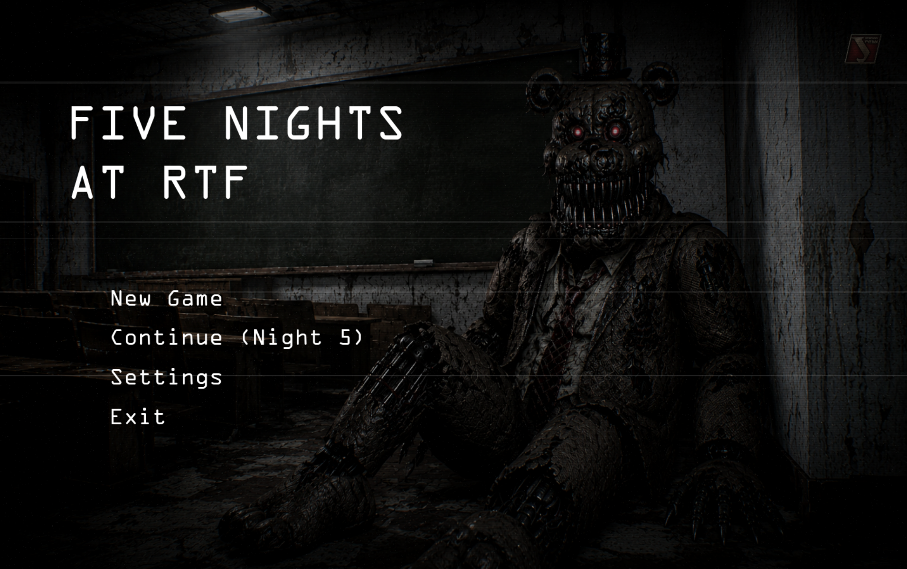
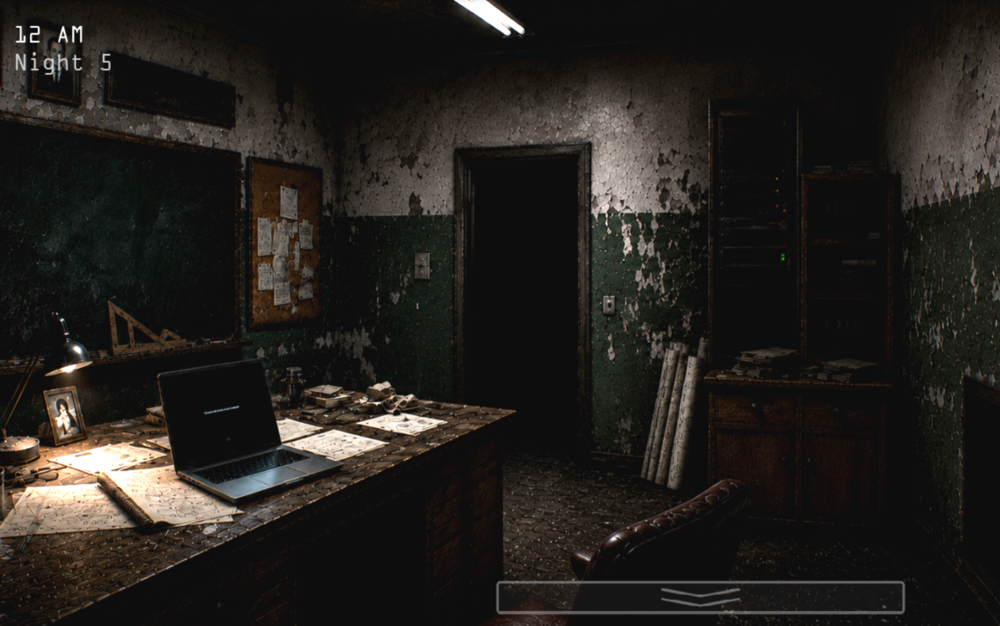
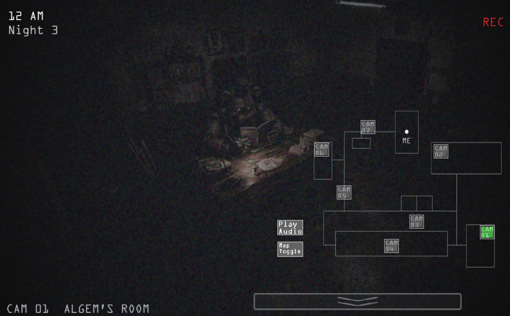
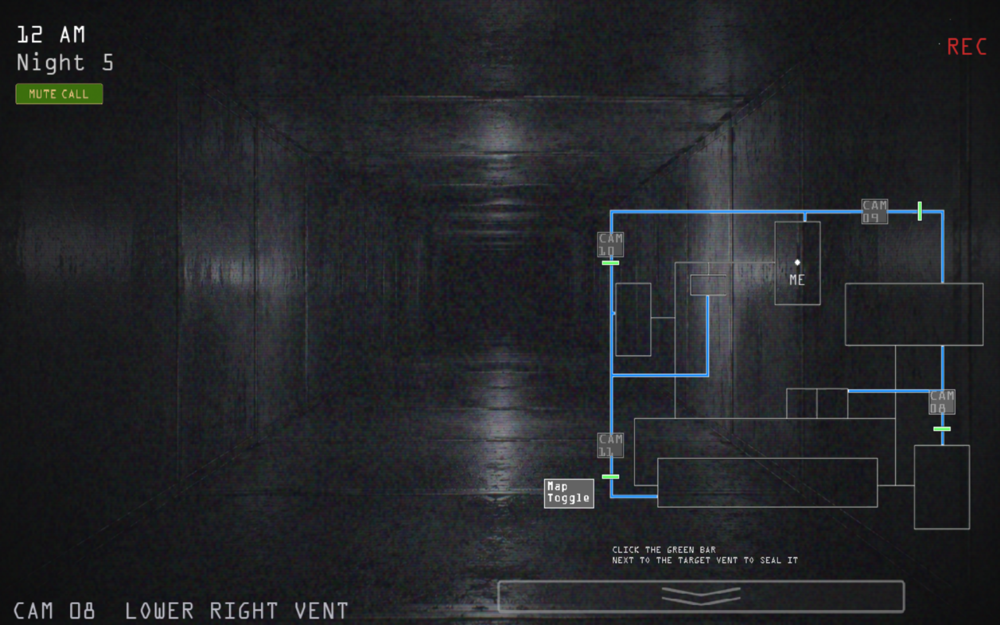
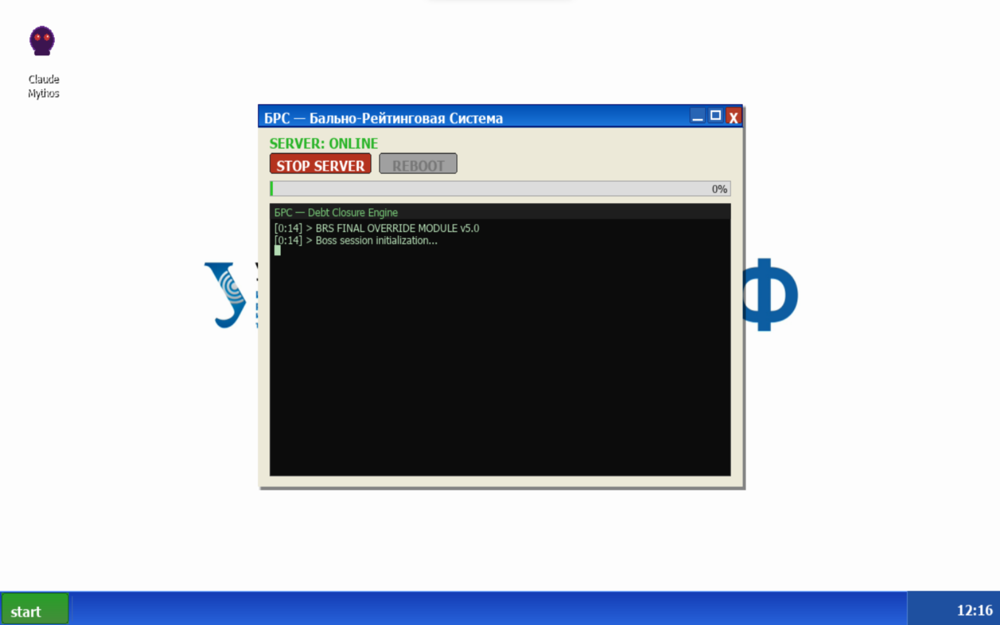
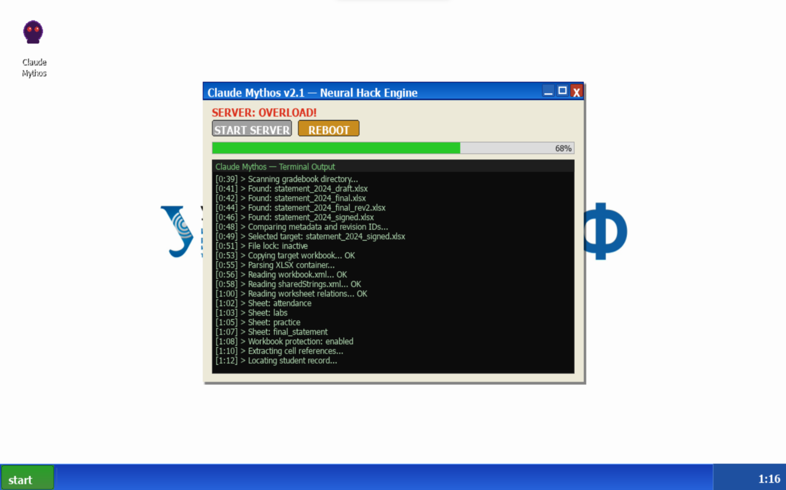
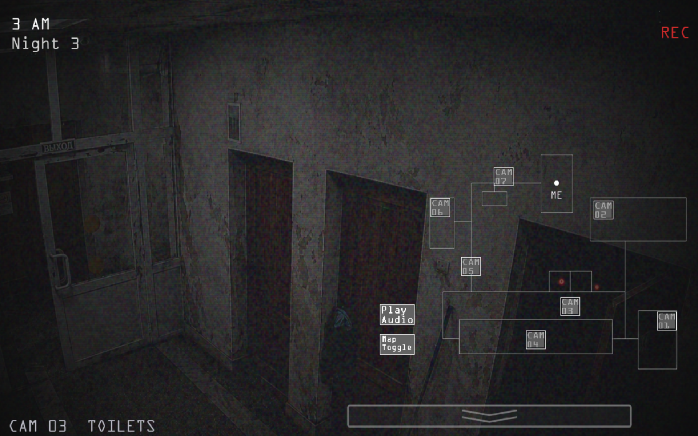
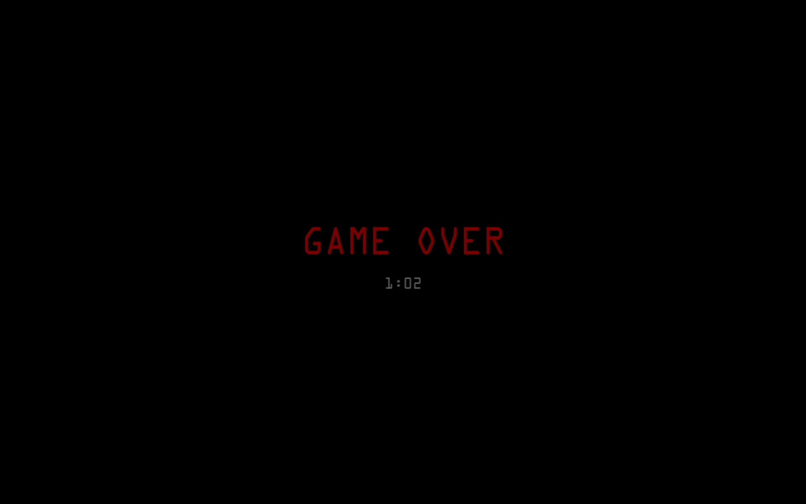

# Five Nights At RTF

<p align="center">
  
</p>

<p align="center">
  <strong>Атмосферный survival horror на Python и Pygame-CE про пять ночей в институте, старый сервер, камеры, вентиляцию и Алгема.</strong>
</p>

<p align="center">
  
  
  
  
</p>

---

## О проекте

**Five Nights At RTF** — это 2D survival horror, вдохновлённый формулой ночного дежурства с камерами, но перенесённый в мрачный институтский сеттинг.

Игрок находится в офисе с ноутбуком, планшетом и доступом к старому серверу. Каждую ночь нужно выполнить очередную рискованную задачу: ведомость, Artemis, Moodle, Exam и БРС. Взлом идёт через ноутбук и сервер, но сервер шумит, привлекает внимание и постепенно делает ситуацию опаснее.

По корпусу ходит **Алгем**. Он реагирует на шум, двигается по камерам, может заходить в вентиляцию, отвлекаться на звуковые приманки и менять маршрут, если игрок закрывает проходы. Чтобы выжить, нужно следить за камерами, управлять сервером, закрывать вентиляцию и вовремя выключать ноутбук.

---

## Атмосфера

Ночь.
Пустой корпус.
Старый сервер в углу.
Тихий шум вентиляции.
Экран ноутбука, который лучше бы не включать.
И камеры, на которых иногда появляется тот, кто не должен был вернуться.

---

## Скриншоты

### Главное меню



### Офис



### Планшет и обычная карта камер



### Карта вентиляции



### Ноутбук и Claude Mythos



### Перегрузка сервера



### Алгем на камере



### Game Over



---

## Сюжет

Игрок — студент, который ночью пробирается в институт, чтобы закрыть учебные долги через внутренние системы.

На сервере установлен **Claude Mythos** — закрытая нейросеть, способная помочь с ведомостью, заданиями, тестами и экзаменационными системами. Но чем дольше работает сервер, тем больше шума он создаёт. А шум привлекает Алгема.

Алгем бродит по корпусу, реагирует на подозрительную активность, слышит сервер, замечает приманки и может добраться до офиса через вентиляцию. Его нельзя победить напрямую. Его можно только задержать, обмануть или переждать.

---

## Ночи

| Ночь       | Цель             | Описание                                                                                                      | Уровень угрозы |
| ---------- | ---------------- | ------------------------------------------------------------------------------------------------------------- | -------------- |
| **Ночь 1** | `Ведомость.docx` | Ознакомительная ночь. Игрок изучает ноутбук, сервер, офис и основные правила.                                 | Низкий         |
| **Ночь 2** | `Artemis`        | Появляется Алгем. Камеры, вентиляция и звуковые приманки становятся важной частью выживания.                  | Средний        |
| **Ночь 3** | `Moodle`         | Алгем активнее реагирует на шум и подозрительную активность. Ошибки начинают стоить дороже.                   | Высокий        |
| **Ночь 4** | `Exam`           | Экзаменационная система повышает риск. Нужно действовать быстрее и внимательнее.                              | Очень высокий  |
| **Ночь 5** | `БРС`            | Финальная ночь. Недостаточно просто завершить взлом — нужно успеть выключить ноутбук и пережить остаток ночи. | Критический    |

---

## Игровой цикл

Каждая ночь строится вокруг нескольких действий:

1. Открыть ноутбук.
2. Запустить Claude Mythos.
3. Включить сервер и начать выполнение ночной задачи.
4. Следить за камерами через планшет.
5. Использовать звуковые приманки, если Алгема нужно отвести.
6. Переключаться на карту вентиляции, если он полез через вентиляцию.
7. Закрывать нужные вентиляционные участки.
8. Останавливать или перезагружать сервер при опасных состояниях.
9. После завершения задачи выключить ноутбук.
10. Дожить до 6 утра.

---

## Основные механики

### Сервер

Сервер отвечает за прогресс ночной задачи. Пока он работает, взлом продвигается вперёд, но вместе с этим растёт опасность.

Сервер может:

* работать в обычном режиме;
* создавать шум;
* привлекать Алгема;
* перегружаться;
* требовать остановки или перезагрузки.

Игрок постоянно выбирает между скоростью прохождения и безопасностью.

### Ноутбук

Ноутбук — основной инструмент для работы с сервером. Через него запускается Claude Mythos, управление сервером, перезагрузка и выключение системы.

На поздних ночах выключение ноутбука становится отдельной частью выживания: завершённая задача не всегда означает безопасность, если ноутбук всё ещё работает.

### Планшет

Планшет открывает доступ к камерам и карте вентиляции.

Через него игрок:

* выбирает камеры;
* смотрит, где находится Алгем;
* переключает обычную карту и vent-карту;
* включает аудио-приманку;
* закрывает вентиляционные участки.

### Камеры

В игре используется система камер по корпусу и вентиляции. Камеры позволяют понимать маршрут Алгема и заранее принимать решения.

Камеры не просто декоративный интерфейс: от наблюдения, звука, маршрутов и состояния вентиляции зависит поведение противника.

### Вентиляция

Вентиляция — короткий и опасный путь к офису. Если Алгем уходит в вентиляцию, игрок должен быстро открыть vent-карту и закрыть правильный участок.

Закрытие вентиляции не является абсолютной защитой. Оно выигрывает время, ломает текущий маршрут и заставляет Алгема перестроить поведение.

### Звуковые приманки

Аудио-приманки позволяют перенаправить Алгема на выбранную камеру. Это помогает выиграть время, отвести угрозу от офиса или продолжить работу сервера.

Приманки работают как рискованный инструмент: ими нужно пользоваться вовремя, иначе можно ухудшить ситуацию.

### Офис

Офис — центр управления. Здесь находятся ноутбук, доступ к планшету и визуальные признаки состояния игры. Игрок может осматриваться мышью, открывать интерфейсы и реагировать на угрозы.

---

## Управление

### Основное управление

| Действие                     | Управление                   |
| ---------------------------- | ---------------------------- |
| Осмотреться в офисе          | Движение мыши влево / вправо |
| Взаимодействие с интерфейсом | Левая кнопка мыши            |
| Открыть / закрыть планшет    | `TAB`                        |
| Закрыть экран ноутбука       | `ESC`                        |
| Быстро остановить сервер     | `S`                          |

### Планшет

| Действие                                     | Управление                                 |
| -------------------------------------------- | ------------------------------------------ |
| Выбрать камеру                               | ЛКМ по иконке камеры на мини-карте         |
| Переключить обычную карту / карту вентиляции | ЛКМ по кнопке `MAP`                        |
| Включить звуковую приманку                   | ЛКМ по кнопке `AUDIO` на обычной карте     |
| Закрыть вентиляционный участок               | ЛКМ по зелёной `SEAL`-полосе на vent-карте |
| Закрыть планшет                              | `TAB`                                      |

### Ноутбук

| Действие                | Управление                              |
| ----------------------- | --------------------------------------- |
| Открыть ноутбук         | ЛКМ по ноутбуку в офисе                 |
| Включить ноутбук        | ЛКМ по кнопке питания                   |
| Открыть меню Start      | ЛКМ по кнопке `Start`                   |
| Запустить Claude Mythos | ЛКМ по иконке или пункту в меню Start   |
| Запустить сервер        | ЛКМ по кнопке запуска сервера           |
| Остановить сервер       | ЛКМ по кнопке остановки сервера или `S` |
| Перезагрузить сервер    | ЛКМ по `REBOOT` при перегрузке          |
| Выключить ноутбук       | Кнопка питания или пункт `Shutdown`     |
| Закрыть окно ноутбука   | `ESC`                                   |

### Служебное управление

Эти клавиши предназначены для настройки и отладки.

| Действие                                     | Управление                            |
| -------------------------------------------- | ------------------------------------- |
| Открыть / закрыть редактор проекции ноутбука | `F8`                                  |
| Выбрать угол проекции                        | `1`, `2`, `3`, `4` в режиме редактора |
| Сдвинуть выбранный угол                      | Стрелки                               |
| Быстро сдвинуть выбранный угол               | `Shift` + стрелки                     |
| Сохранить проекцию                           | `S` в режиме редактора                |
| Сбросить проекцию                            | `R` в режиме редактора                |
| Перетащить угол мышью                        | ЛКМ по углу в режиме редактора        |

---

## Архитектура

Проект построен по модульной архитектуре с разделением ответственности между моделью, отображением, контроллерами, сервисами, аудио и ИИ.

```text
Five-Nights-At-RTF/
├── main.py
├── fnar/
│   ├── gameplay/
│   │   ├── ai_domain.py
│   │   ├── algem_ai.py
│   │   ├── camera_graph.py
│   │   ├── camera_renderer.py
│   │   ├── gameplay_audio.py
│   │   ├── glitch_controller.py
│   │   ├── hack_logs.py
│   │   ├── input_controller.py
│   │   ├── laptop_controller.py
│   │   ├── laptop_projection.py
│   │   ├── laptop_renderer.py
│   │   ├── model.py
│   │   ├── office_renderer.py
│   │   ├── pathfinding.py
│   │   ├── presenter.py
│   │   ├── screamer.py
│   │   ├── tablet_controller.py
│   │   ├── ui_hitboxes.py
│   │   ├── vent_audio_controller.py
│   │   ├── vent_seal.py
│   │   ├── view.py
│   │   └── view_assets.py
│   ├── menu/
│   │   ├── assets.py
│   │   ├── audio.py
│   │   ├── effects.py
│   │   ├── model.py
│   │   ├── presenter.py
│   │   └── view.py
│   └── services/
│       ├── audio_mix.py
│       ├── laptop_power.py
│       ├── save.py
│       ├── screen_capture.py
│       ├── screen_scaler.py
│       ├── settings.py
│       ├── spatial_audio.py
│       └── visual_assets.py
├── assets/
├── sounds/
├── config/
├── tests/
│   ├── unit/
│   └── manual/
├── tools/
├── pyproject.toml
├── uv.lock
└── README.md
```

---

## Model-View-Presenter

Игровая часть разделена по принципу **Model-View-Presenter**.

| Компонент             | Роль                                                                                                   |
| --------------------- | ------------------------------------------------------------------------------------------------------ |
| `GameModel`           | Хранит состояние ночи, таймер, прогресс, сервер, камеры, вентиляцию, Алгема и условия победы/поражения |
| `GameView`            | Тонкий фасад отображения игрового экрана                                                               |
| `GamePresenter`       | Связывает модель, ввод, звук, контроллеры и отрисовку                                                  |
| `InputController`     | Обрабатывает клавиатуру, мышь и служебные режимы                                                       |
| `TabletController`    | Управляет планшетом, картами и переключением камер                                                     |
| `LaptopController`    | Управляет ноутбуком, запуском, выключением, Claude Mythos и сервером                                   |
| `GameplayAudio`       | Отвечает за основные игровые звуки                                                                     |
| `VentAudioController` | Отвечает за звуки вентиляции и угрозы                                                                  |
| `CameraRenderer`      | Рисует камеры, карту, vent-карту и CCTV-слои                                                           |
| `LaptopRenderer`      | Рисует ноутбук, рабочий стол, Claude Mythos и power-состояния                                          |
| `OfficeRenderer`      | Рисует офис и основные игровые слои                                                                    |

Такое разделение позволяет развивать интерфейс, звук, ИИ и модель независимо друг от друга.

---

## Инженерные особенности

### Чистая структура

Крупные части игры разделены на отдельные модули:

* ИИ не занимается отрисовкой;
* рендереры не меняют правила игры;
* контроллеры ввода не хранят состояние ночи;
* сервисы сохранений и настроек отделены от gameplay-логики;
* алгоритмы поиска пути вынесены в отдельный модуль.

### Переиспользование логики

Повторяющиеся операции вынесены в общие компоненты:

* поиск пути — `pathfinding.py`;
* граф камер — `camera_graph.py`;
* вентиляционные блокировки — `vent_seal.py`;
* сценарии терминала — `hack_logs.py`;
* масштабирование окна — `screen_scaler.py`;
* аудио-микширование — `audio_mix.py`;
* сохранения — `save.py`;
* настройки — `settings.py`.

### Простота расширения

Новые ночи, события, строки терминала, звуки, камеры и состояния ИИ можно добавлять без переписывания основного игрового цикла. Основные данные и подсистемы вынесены в отдельные места, поэтому проект остаётся расширяемым.

### Читаемость

Код разделён на небольшие классы и функции с понятными зонами ответственности. Публичные компоненты и неочевидные алгоритмы документированы docstring-ами, а магические значения вынесены в именованные константы или конфигурационные структуры.

---

## ИИ Алгема

Алгем управляется не случайными телепортами, а системой состояний и графовыми маршрутами.

Он может:

* патрулировать корпус;
* реагировать на серверный шум;
* идти к аудио-приманке;
* искать путь к офису;
* заходить в вентиляцию;
* отступать после закрытия прохода;
* перестраивать маршрут при изменении карты.

### Состояния

| Состояние     | Поведение                                    |
| ------------- | -------------------------------------------- |
| `IDLE`        | Ожидание и накопление интереса               |
| `PATROL`      | Патруль по камерам                           |
| `INVESTIGATE` | Проверка источника шума или приманки         |
| `ATTACK`      | Движение к офису                             |
| `VENT_STALK`  | Продвижение через вентиляцию                 |
| `BREACH`      | Финальная стадия угрозы                      |
| `STUNNED`     | Временная остановка                          |
| `RETREAT`     | Отступление после блокировки или потери цели |

---

## Алгоритмы

В игре используются несколько алгоритмов поиска и управления поведением.

| Алгоритм | Сложность словами                             | O-нотация                 | Где используется                                                                            |
| -------- | --------------------------------------------- | ------------------------- | ------------------------------------------------------------------------------------------- |
| **BFS**  | Простой                                       | `O(V + E)`                | Поиск ближайшего пути, дистанции между камерами, проверка доступности маршрутов             |
| **DFS**  | Средний                                       | `O(V + E)`                | Патруль и обход веток графа                                                                 |
| **A***   | Сложный                                       | `O((V + E) log V)`        | Целенаправленный маршрут к офису с учётом приоритета и эвристики                            |
| **FSM**  | Простой по вычислениям, важный по архитектуре | `O(1)` на выбор состояния | Переключение поведения Алгема между ожиданием, патрулём, атакой, вентиляцией и отступлением |

Где:

* `V` — количество узлов графа;
* `E` — количество соединений между узлами.

ИИ учитывает не только карту, но и игровые факторы:

* активность сервера;
* текущую ночь;
* прогресс взлома;
* выбранную камеру;
* включённую звуковую приманку;
* закрытые вентиляционные участки;
* опасность короткого пути к офису;
* состояние ноутбука и сервера.

---

## Камеры и граф маршрутов

Карта камер и вентиляции представлена как граф.

Обычные камеры описывают комнаты и коридоры. Вентиляционные камеры описывают короткие опасные маршруты. Когда игрок закрывает вентиляционный участок, граф меняется, а Алгем вынужден перестраивать путь.

Такой подход делает поведение противника читаемым, но не полностью предсказуемым.

---

## Звук

Звук является частью геймплея, а не только фоном.

В игре используются:

* фоновая атмосфера;
* звуки сервера;
* звуки ноутбука;
* переключение камер;
* вентиляционные звуки;
* звуковые приманки;
* предупреждения об угрозе;
* скримеры;
* UI-звуки;
* сюжетные звонки и лекции.

Аудио-система учитывает игровое состояние: где находится Алгем, какая камера открыта, есть ли активный сервер, закрыта ли вентиляция и насколько близко угроза.

---

## Визуальная система

Отрисовка разделена на независимые слои:

* офис;
* планшет;
* камеры;
* vent-карта;
* ноутбук;
* меню;
* эффекты помех;
* power-анимации;
* скримеры.

Оконный и полноэкранный режимы используют единый подход к масштабированию, чтобы сохранять композицию кадра и не ломать пропорции изображения.

---

## Сохранения и настройки

Проект поддерживает:

* сохранение прогресса;
* открытие ночей;
* хранение пользовательских настроек;
* настройки звука;
* настройки отображения;
* runtime-файлы вне git-репозитория.

Локальные сохранения и настройки не должны попадать в репозиторий, потому что относятся к конкретному запуску игры.

---

## Установка

### Требования

* Python `3.14+`
* `uv`

### Установка uv

Windows PowerShell:

```powershell
powershell -ExecutionPolicy ByPass -c "irm https://astral.sh/uv/install.ps1 | iex"
```

Linux / macOS:

```bash
curl -LsSf https://astral.sh/uv/install.sh | sh
```

### Запуск

```bash
git clone https://github.com/krangras/Five-Nights-At-RTF.git
cd Five-Nights-At-RTF
uv run main.py
```

При запуске `uv` автоматически создаёт виртуальное окружение и устанавливает зависимости из `pyproject.toml` и `uv.lock`.

---

## Разработка

### Проверка компиляции

```bash
python -m compileall main.py fnar tests
```

### Unit-тесты

```bash
uv run --group dev pytest tests/unit -v
```

### Ручные тесты

Интерактивные сценарии находятся в:

```text
tests/manual/
```

Они используются для проверки игровых состояний, отображения, камер, звука и поведения в реальном окне Pygame.

---

## Технологии

| Технология       | Назначение                                                  |
| ---------------- | ----------------------------------------------------------- |
| **Python 3.14+** | Основной язык проекта                                       |
| **Pygame-CE**    | Окно, игровой цикл, ввод, звук и отрисовка                  |
| **NumPy**        | Числовые операции и обработка аудио                         |
| **OpenCV**       | Проекция экрана ноутбука и визуальная обработка             |
| **MSS**          | Захват изображения экрана для отдельных визуальных эффектов |
| **Pillow**       | Работа с изображениями                                      |
| **pytest**       | Автоматические тесты                                        |
| **uv**           | Управление зависимостями и запуск проекта                   |
| **PyInstaller**  | Сборка standalone-версий                                    |

---

## Особенности

* 5 ночей с разными задачами и уровнем угрозы;
* 7 обычных камер и 4 вентиляционные камеры;
* обычная карта и vent-карта на планшете;
* звуковые приманки;
* вентиляционные блокировки;
* сервер с риском перегрузки;
* ноутбук с Claude Mythos;
* ИИ Алгема на основе FSM и алгоритмов поиска пути;
* граф камер и вентиляции;
* отдельные рендереры для офиса, камер и ноутбука;
* отдельные контроллеры для ввода, планшета, ноутбука, звука и glitch-событий;
* сохранения и настройки;
* автоматические и ручные тесты;
* масштабирование под оконный и полноэкранный режим.

---

## Безопасность и дисклеймер

Все события, связанные со “взломом”, являются частью художественного сюжета. Игра не содержит реальных инструментов для доступа к чужим системам и не предназначена для обхода защиты реальных сервисов.

---

## Лицензия

MIT License.

Свободное использование, изменение и распространение проекта разрешены при сохранении текста лицензии.
