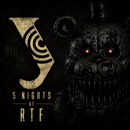

<p align="center">
  
</p>

<h1 align="center">Five Nights At RTF</h1>

<p align="center">
  <b>Хоррор-выживание по мотивам FNAF. Переживи 5 ночей, взломай сервер, не дай Алгему зайти.</b>
</p>

<p align="center">
  
  
  
</p>

---

## Сюжет

Ты — студент, который решил схитрить и **взломать БРС** (балльно-рейтинговую систему), чтобы поставить себе оценки. Проблема в том, что по ночам в корпусе бродит **Алгем** — и он явно не рад твоим планам.

С **0:00** до **6:00** тебе нужно:

- **Взломать что-нибудь** через ноутбук и сервер с предустановленным Claude Mythos — взлом автоматический, но привлекает Алгема
- **Следить за камерами** через планшет — 7 комнат + 4 вент-камеры
- **Блокировать вентиляцию** — закрывай шахты, пока Алгем не добрался через вентиляцию
- **Включать звуковые приманки** — отвлекай Алгема звуком на камерах

Если Алгем до тебя добрался — **game over**. Дожил до 6 утра и сервер взломан — **победа**. Не успел взломать сервер за ночь — **game over**.

## Управление

| Клавиша | Действие |
|---------|----------|
| `TAB` | Открыть / закрыть планшет |
| `←` `→` | Смена камеры (обычные 1-7, венты 8-11, циклически между собой) |
| `1`-`9` | Переключиться на камеру по номеру |
| Клик **Toggle** | Переключить карту |
| Клик **Audio** | Включить звуковую приманку на текущей камере (кроме вентиляции)|
| Клик **по зелёной полосе** | Заблокировать шахту вентиляции |
| `ESC` | Закрыть ноутбук |

## Архитектура

```
Five Nights At RTF/
├── main.py                  # Игровой цикл и конечный автомат состояний
├── fnar/                    # Пакет приложения
│   ├── menu/                # Меню: Model / View / Presenter и ресурсы
│   ├── gameplay/            # Игровая модель, отображение, ввод и ИИ
│   │   ├── ai_domain.py     # Enum/dataclass домена ИИ
│   │   ├── pathfinding.py   # BFS / DFS / A* и эвристики графа
│   │   ├── vent_seal.py     # Контроллер блокировки вентиляции
│   │   ├── hack_logs.py     # Сценарии терминальных логов
│   │   ├── view.py          # Тонкий фасад отображения
│   │   ├── view_assets.py   # Загрузка и кэширование графики
│   │   ├── laptop_renderer.py / camera_renderer.py / office_renderer.py
│   │   │                     # Независимые части отрисовки
│   │   ├── presenter.py     # Оркестрация одного игрового тика
│   │   ├── input_controller.py / laptop_controller.py / tablet_controller.py
│   │   │                     # Ввод и контроллеры интерфейсов
│   │   └── gameplay_audio.py / vent_audio_controller.py
│   │                         # Ленивая загрузка, микширование и vent-аудио
│   └── services/            # Сохранения, настройки, звук и общие сервисы
├── config/                  # Конфигурация по умолчанию
├── assets/                  # Текстуры, шрифты, изображения камер
│   ├── cameras/             # 11 фонов камер
│   ├── vents_cameras/       # Виды вент-камер + состояния seal
│   ├── office/              # Фоны офиса + состояния сервера
│   ├── screamer/            # Анимации смерти (офис + венты)
│   ├── cctv/                # CCTV-эффекты наложении
│   └── logo/                # Иконка игры
├── sounds/                  # Все аудио-ассеты
│   ├── ambience/            # Фоновая атмосфера
│   ├── cameras/             # Звуки переключения камер
│   ├── vents/               # Звуки вентиляции
│   ├── screamer/            # Звуки смерти
│   ├── laptop/              # Звуки загрузки ноутбука
│   ├── server/              # Звуки состояния сервера
│   ├── threats/             # Угрозы Алгема
│   ├── lectures/            # Лекции при game over
│   └── ui/                  # UI-звуки
└── tests/
    ├── unit/                # Автоматические pytest-тесты
    └── manual/              # Интерактивные Pygame-сценарии
```

## Качество архитектуры: SOLID, DRY, KISS

Проект специально разнесён на маленькие компоненты, чтобы не было одного огромного файла, который одновременно хранит состояние, рисует экран, считает маршруты и обрабатывает звук. Это соответствует архитектурной части критериев оценки: модель хранит данные и бизнес-логику, представление отвечает за отрисовку, а Presenter связывает ввод игрока с моделью.

| Принцип | Как реализован в проекте | Где смотреть |
|---------|---------------------------|--------------|
| **S — Single Responsibility** | Каждая подсистема отвечает за одну задачу: ИИ ходит по графу, pathfinding ищет маршрут, vent seal строит заблокированный граф, hack logs выдаёт строки терминала | `fnar/gameplay/algem_ai.py`, `pathfinding.py`, `vent_seal.py`, `hack_logs.py` |
| **O — Open/Closed** | Поведение расширяется добавлением новых состояний FSM, новых профилей ночей, новых строк логов или новых рёбер графа без переписывания игрового цикла | `AIState`, `NightProfile`, `HACK_LOG_SEQUENCES`, `BASE_GRAPH` |
| **L — Liskov Substitution** | Доменные подсистемы подключены композицией, а узкие stateless mixin-компоненты View/Presenter расширяют фасады без изменения их контракта | `GameModel`, `GameView`, `GamePresenter` |
| **I — Interface Segregation** | View не получает доступ к внутренностям ИИ. Для отображения есть узкие свойства: `algem_location`, `algem_state_name`, `drain_algem_events()` | `fnar/gameplay/model.py` |
| **D — Dependency Inversion** | Высокоуровневая модель делегирует низкоуровневые детали отдельным объектам и чистым функциям. Например, граф seal не собирается вручную внутри `update()` | `VentSealController.current_graph()` |

### DRY

Дублирование вынесено в общие функции и компоненты:

- поиск пути находится в одном модуле `pathfinding.py`, а не размазан по ИИ и модели;
- события, состояния и профиль ночи вынесены в `ai_domain.py`;
- сборка графа при закрытых вентах находится в `VentSealController`, поэтому логика seal не копируется в разные места;
- терминальные логи взлома вынесены в `HackLogPlayer`, поэтому `GameModel` больше не хранит огромный сценарный контент внутри себя;
- повторяющиеся проверки и безопасные изменения состояния закрыты методами вроде `set_hack_attraction()`, `ensure_attention_at_least()`, `reset_after_office_repel()`.

### KISS

Код упрощён так, чтобы его было легче объяснять на защите:

- алгоритмы поиска пути являются чистыми функциями: вход — граф, выход — путь;
- `GameModel.update()` остался главным сценарием ночи и вызывает маленькие методы-подсистемы по порядку;
- тяжёлые таблицы данных отделены от логики;
- вместо сложной иерархии классов используется простая композиция;
- публичные контракты и неочевидные алгоритмы документированы, а очевидные приватные helpers не перегружены шаблонными комментариями.


## Чистота кода

Финальный проход по проекту направлен на читаемость исходников и отсутствие скрытых «магических» значений.

| Что проверено | Как сделано | Пример |
|---------------|-------------|--------|
| **Магические константы** | Ключевые тайминги, размеры, цвета, диапазоны и системные коды вынесены в именованные константы | `PYGAME_MIXER_CHANNELS`, `DISCLAIMER_IMAGE_ASPECT_RATIO`, `MIN_EDGE_WEIGHT`, `MenuModel.MAX_NIGHT` |
| **Константы в классах** | В классах, где есть собственные настройки поведения, значения лежат в начале класса | `MenuView.DESIGN_WIDTH`, `MenuView.COLOR_HOVER`, `ScreamerPlayer.DEFAULT_DOOR_FRAMES` |
| **Мёртвый код** | Удалены лишние импорты и проверен закомментированный код: отключённых старых реализаций в исходниках нет | `GameModel` больше не импортирует неиспользуемый `AIState` |
| **Документация** | Docstring оставлены у публичных контрактов и сложных алгоритмов; автогенерируемые блоки, повторявшие имя функции, удалены | `pathfinding.py`, фасады MVP и контроллеры подсистем |
| **Комментарии** | Оставлены поясняющие комментарии только там, где они объясняют алгоритм, игровой сценарий или неочевидную связь с ассетами | FSM Алгема, seal-граф, vent-map координаты, обработка звука |

В Python нет ключевого слова `const`, поэтому проект использует стандартный стиль: именованные константы пишутся в `UPPER_CASE`, а настройки конкретных классов лежат в начале класса как class attributes.

## Стек технологий

- **Python 3.14+** / **Pygame-CE 2.5**
- **OpenCV** — проекция экрана ноутбука с перспективой
- **NumPy** — аудиообработка, матричные операции
- **MSS** — захват экрана для ноутбука
- **Pillow** — обработка изображений

## Система ИИ

Алгем использует **конечный автомат**. Это не случайное телепортирование, а набор понятных состояний, между которыми ИИ переходит по условиям игры.

| Состояние | Поведение |
|-----------|-----------|
| **IDLE** | Короткая пауза, ожидание роста интереса |
| **PATROL** | DFS-патруль по безопасной зоне камер |
| **INVESTIGATE** | BFS/DFS-маршрут к шуму, серверу или приманке |
| **ATTACK** | A* к офису по актуальному графу |
| **VENT_STALK** | Атака через вентиляцию с учётом seal |
| **BREACH** | Алгем уже ушёл с последней vent-камеры, игрок получает окно реакции |
| **STUNNED / RETREAT** | Блокировка маршрута, отступление к безопасной точке |

| Алгоритм | Где применяется | Сложность |
|----------|-----------------|-----------|
| **BFS** | кратчайшая дистанция до цели, проверка слышимости приманки, возврат из blocked-состояний | `O(V + E)` |
| **DFS** | патруль обычных камер и обход непосещённых веток | `O(V + E)` |
| **A*** | целевая атака к офису и detour-маршруты | `O((V + E) log V)` |
| **FSM** | переключение IDLE → PATROL → ATTACK → BREACH/RETREAT | `O(1)` на выбор состояния |
| **Кэш графов/эвристик** | seal-граф и расстояния до цели пересчитываются только при изменении состояния карты | экономит повторные BFS/A* |

ИИ реагирует на действия игрока:
- Включённый сервер повышает шкалу внимания Алгема
- Реклама привлекает Алгема после 2-секундного окна безопасности
- Звуковые приманки перенаправляют Алгема к источнику звука (в радиусе 2 комнат)
- Долгое наблюдение за камерой увеличивает стоимость рёбер — Алгем обходит эту комнату
- Seal блокируют выходы из вентов, заставляя идти длинным путём

## Система вентиляции

Два вентиляционных канала (`VENT_A`, `VENT_B`):
- **4 точки блокировки** — клик для закрытия, 5 секунд на SEAL
- **Случайные поломки** — венты периодически ломаются, открывая короткие пути
- **Кнопки сброса** — восстанавливают сломанные венты
- При поломке вента Алгем получает **короткий маршрут** к офису

## Установка

### 1. Установи [uv](https://docs.astral.sh/uv/getting-started/installation/)

```bash
# Windows (PowerShell)
powershell -ExecutionPolicy ByPass -c "irm https://astral.sh/uv/install.ps1 | iex"

# Linux / Mac
curl -LsSf https://astral.sh/uv/install.sh | sh
```

### 2. Запусти игру

```bash
git clone https://github.com/krangras/Five-Nights-At-RTF.git
cd "Five Nights At RTF"
uv run main.py
```

Первый запуск автоматически создаст `.venv` и установит все зависимости. Повторные запуски — просто `uv run main.py`.

## Тесты

```bash
uv run --group dev pytest tests/unit -v
```

---

<p align="center">
  <i>Взломай БРС. Не дай Алгему зайти.</i>
</p>
